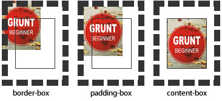
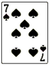
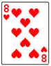
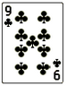
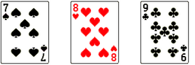
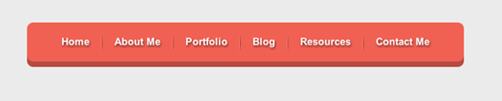

# 5.1 CSS3背景 background-origin
设置元素背景图片的**原始起始位置**。

语法：
```css
background-origin ： border-box | padding-box | content-box;
```
参数分别表示背景图片是从**边框**，还是**内边距（默认值）**，或者是**内容区域**开始显示。

效果如下：



需要注意的是，如果背景不是`no-repeat`，这个属性无效，它会从边框开始显示。
# 5.2 CSS3背景 background-clip
用来将背景图片做适当的裁剪以适应实际需要。

语法：
```css
background-clip ： border-box | padding-box | content-box | no-clip
```
参数分别表示从`边框`、或`内填充`，或者`内容区域`向外裁剪背景。`no-clip`表示不裁切，和参数`border-box`显示同样的效果。`backgroud-clip`默认值为`border-box`。

效果如下图所示：


# 5.3 CSS3背景 background-size
设置背景图片的大小，以长度值或百分比显示，还可以通过 `cover` 和 `contain` 来对图片进行伸缩。

语法：
```css
background-size: auto | <长度值> | <百分比> | cover | contain
```
取值说明：

- 1、`auto` ：默认值，不改变背景图片的原始高度和宽度；

- 2、<长度值>：成对出现如 `200px 50px`，将背景图片宽高依次设置为前面两个值，当设置一个值时，将其作为图片宽度值来等比缩放；

- 3、<百分比>：`0％~100％` 之间的任何值，将背景图片宽高依次设置为所在元素宽高乘以前面百分比得出的数值，当设置一个值时同上；

- 4、`cover` ：顾名思义为覆盖，即将背景图片等比缩放以`填满整个容器`；

- 5、`contain` ：容纳，即将背景图片等比缩放至`某一边紧贴容器边缘为止`。

# 5.4 CSS3背景 multiple backgrounds
多重背景，也就是`CSS2`里`background`的属性外加`origin`、`clip`和`size`组成的新`background`的多次叠加，缩写时为用逗号隔开的每组值；用分解写法时，如果有多个背景图片，而其他属性只有一个（例如`background-repeat`只有一个），表明所有背景图片应用该属性值。

语法缩写如下：
```css
background ： [background-color] | [background-image] | [background-position][/background-size] | [background-repeat] | [background-attachment] | [background-clip] | [background-origin],...
```
可以把上面的缩写拆解成以下形式：
```css
background-image:url1,url2,...,urlN;
```
```css
background-repeat : repeat1,repeat2,...,repeatN;
backround-position : position1,position2,...,positionN;
background-size : size1,size2,...,sizeN;
background-attachment : attachment1,attachment2,...,attachmentN;
background-clip : clip1,clip2,...,clipN;
background-origin : origin1,origin2,...,originN;
background-color : color;
```
注意：

- 1、用逗号隔开每组 `background` 的缩写值；
- 2、如果有 `size` 值，需要紧跟 `position` 并且用 `"/"` 隔开，`background`值可以为；

```
background-position:left top,right bottom //左上角，右下角等
```

- 3、如果有多个背景图片，而其他属性只有一个（例如 `background-repeat` 只有一个），表明所有背景图片应用该属性值。
- 4、`background-color` 只能设置一个。
举例：

有三张单独的图片：







使用多背景技术实现：



# 练习制作如下一个导航条


[源码](nav.html)

## 要求
- 1、制作导航圆角

>提示：使用border-radius实现圆角

- 2、制作导航立体风格

>提示：使用box-shadow实现立体风格

- 3、制作导航分隔线

>提示：使用渐变与伪元素制作

- 4、删除第一个和最后一个导航分隔线

>提示：使用伪元素删除第一个和最后一个分隔线
