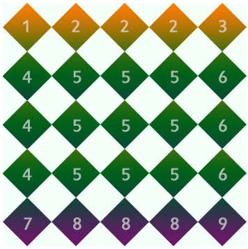

# 1.1 什么是css3
CSS3是CSS2的升级版本，3只是版本号，它在CSS2.1的基础上增加了很多强大的新功能。 目前主流浏览器chrome、safari、firefox、opera、甚至360都已经支持了CSS3大部分功能了，IE10以后也开始全面支持CSS3了。

在编写CSS3样式时，不同的浏览器可能需要不同的前缀。它表示该CSS属性或规则尚未成为W3C标准的一部分，是浏览器的私有属性，虽然目前较新版本的浏览器都是不需要前缀的，但为了更好的向前兼容前缀还是少不了的。


|前缀|浏览器|
|---|---|
|-webkit|chrome和safari|
|-moz|firefox|
|-ms|IE|
|-o|opera|


# 1.2 CSS3能做什么？
CSS3给我们带来了什么好处呢？简单的说，CSS3把很多以前需要使用图片和脚本来实现的效果、甚至动画效果，只需要短短几行代码就能搞定。比如圆角，图片边框，文字阴影和盒阴影，过渡、动画等。

CSS3简化了前端开发工作人员的设计过程，加快页面载入速度。

# 2.1 CSS3边框 圆角效果 border-radius
 border-radius是向元素添加圆角边框。
 ## 使用方法：
 ```html
border-radius:10px; /* 所有角都使用半径为10px的圆角 */ 
```
```
border-radius: 5px 4px 3px 2px; /* 四个半径值分别是左上角、右上角、右下角和左下角，顺时针 */ 
```
 不要以为border-radius的值只能用px单位，你还可以用百分比或者em，但兼容性目前还不太好。

- 实心上半圆：

方法：把高度(height)设为宽度（width）的一半，并且只设置左上角和右上角的半径与元素的高度一致（大于也是可以的）。
```
div{
    height:50px;/*是width的一半*/
    width:100px;
    background:#9da;
    border-radius:50px 50px 0 0;/*半径至少设置为height的值*/
    }

```
- 实心圆：
方法：把宽度（width）与高度(height)值设置为一致（也就是正方形），并且四个圆角值都设置为它们值的一半。如下代码：
```
div{
    height:100px;/*与width设置一致*/
    width:100px;
    background:#9da;
    border-radius:50px;/*四个圆角值都设置为宽度或高度值的一半*/
    }
```
# 2.2 CSS3边框 阴影 box-shadow（一）
box-shadow是向盒子添加阴影。支持添加一个或者多个。

很简单的一段代码，就实现了投影效果，酷毙了。我们来看下语法：
```
box-shadow: X轴偏移量 Y轴偏移量 [阴影模糊半径] [阴影扩展半径] [阴影颜色] [投影方式]
```
**注意：inset 可以写在参数的第一个或最后一个，其它位置是无效的**
- 为元素设置外阴影：

示例代码：
```
.box_shadow{
  box-shadow:4px 2px 6px #333333; 
}
```
- 为元素设置内阴影：

示例代码：
```
.box_shadow{
  box-shadow:4px 2px 6px #333333 inset; 
}
```
- 添加多个阴影：
以上的语法的介绍，就这么简单，如果添加多个阴影，只需用逗号隔开即可。如：
```
.box_shadow{
    box-shadow:4px 2px 6px #f00, -4px -2px 6px #000, 0px 0px 12px 5px #33CC00 inset;
}
```
# 2.3 CSS3边框 阴影 box-shadow（二）
## 阴影模糊半径与阴影扩展半径的区别

- 阴影模糊半径：此参数可选，其值只能是为正值，如果其值为0时，表示阴影不具有模糊效果，其值越大阴影的边缘就越模糊；

- 阴影扩展半径：此参数可选，其值可以是正负值，如果值为正，则整个阴影都延展扩大，反之值为负值时，则缩小；

## X轴偏移量和Y轴偏移量值可以设置为负数

box-shadow: X轴偏移量 Y轴偏移量 [阴影模糊半径] [阴影扩展半径] [阴影颜色] [投影方式];
X轴偏移量为负数：
```
.boxshadow-outset{
    width:100px;
    height:100px;
    box-shadow:-4px 4px 6px #666;
}
```


Y轴偏移量为负数：
```
.boxshadow-outset{
    width:100px;
    height:100px;
    box-shadow:4px -4px 6px #666;
}

```
# 2.4 CSS3边框 为边框应用图片 border-image
顾名思义就是为边框应用背景图片，它和我们常用的background属性比较相似。例如：
```
background:url(xx.jpg) 10px 20px no-repeat;
```

但是又比背景图片复杂一些。


>想象一下：一个矩形，有四个边框。如果应用了边框图片，图片该怎么分>布呢？ 图片会自动被切割分成四等分。用于四个边框。
>可以理解为它是一个切片工具，会自动把用做边框的图片切割。怎么切割呢？为了方便理解，做了一张特殊的图片，由9个矩形（70*70像素）拼成>的一张图（210*210像素），并标注好序号，是不是像传说中的九宫图，

如下：


我们把上图当作边框图片 来应用一下， 看一看是什么效果

根据border-image的语法：


```
#border-image{
   background:#F4FFFA;
   width:210px; height:210px; border:70px solid #ddd;
   border-image:url(borderimg.png) 70 repeat  
}

```


从序号可以看出div的四个角分别对应了背景图片的四个角。而2,4,6,8 被重复。5在哪？因为是从四周向中心切割图片的所以，5显示不出来。


而在chrome浏览器中5是存在的，下图的样子：




- repeat的意思就是重复，目前因为是刚好被整除，效果看不出来。如果改下DIV的宽高，再来看重复的效果：


边角部分为裁掉了，可见repeat就是一直重复，然后超出部分剪裁掉，而且是居中开始重复。

- Round 参数：Round可以理解为圆满的铺满。为了实现圆满所以会压缩（或拉伸）；
```
#border-image {

     width:170px;

     height:170px;

     border:70px solid;

     border-image:url(borderimg.png) 70 round;

 }

 ```
效果：


可见图片被压扁了。

- Stretch 很好理解就是拉伸，有多长拉多长。有多远“滚”多远。
```
border-image:url(borderimg.png) 70 stretch
```
看一下效果：


2,4,6,8分别被拉伸显示。

**注意：Chrome下，中间部分也会被拉伸，webkit浏览器对于round属性和repeat属性似乎没有区分，显示效果是一样的。**

Firefox 26.0 下是可以准确区分的。