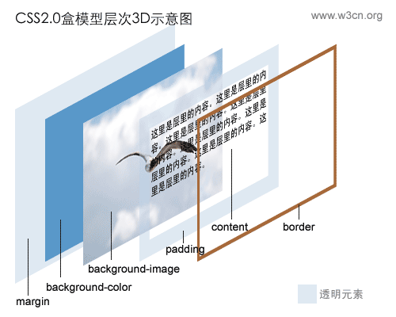
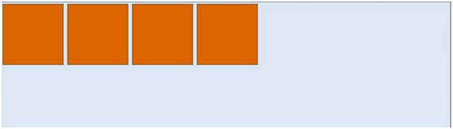
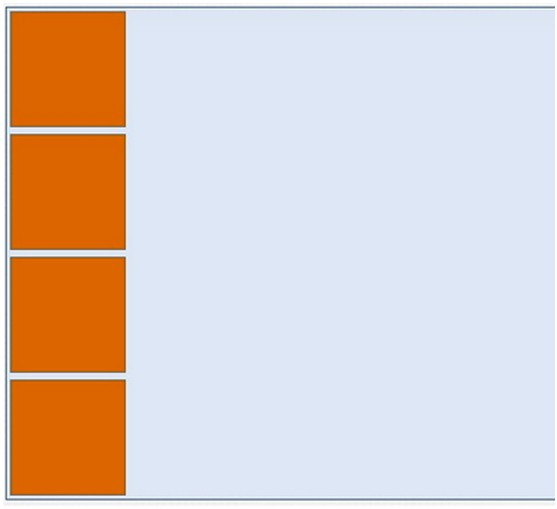
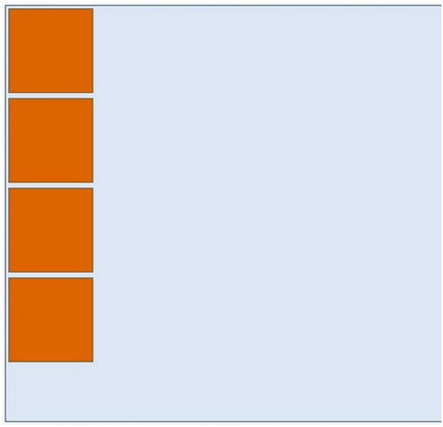

# CSS3 多列布局——Columns
为了能在Web页面中方便实现类似报纸、杂志那种多列排版的布局，W3C特意给CSS3增加了一个`多列布局模块`（CSS Multi Column Layout Module）。它主要应用在文本的`多列布局`方面，这种布局在报纸和杂志上都使用了几十年了，但要在Web页面上实现这样的效果还是有相当大的难度，庆幸的是，CSS3的多列布局可以轻松实现。接下来咱们一起学习多列布局相关的知识。

**其语法规则如下:**

```css
columns：<column-width> || <column-count>
```

多列布局columns属性参数主要就两个属性参数：`列宽`和`列数`。

|参数|参数说明|
|:--:|:--:|
|`<column-width>`|主要用来定义多列中每列的宽度|
|`<column-count>`|主要用来定义多列中的列数|


举例：
要显示2栏显示，每栏宽度为200px，代码为：.

```css
columns: 200px 2;
```

到目前为止大部分主流浏览器都对其支持：

# CSS3 多列布局——column-width
`column-width`的使用和CSS中的width属性一样，不过不同的是，`column-width`属性在定义元素列宽的时候，既可以单独使用，也可以和多列属性中其他属性配合使用。

**其语法规则如下:**

```css
column-width: auto | <length>
```

取值说明

|属性值|说明|
|:--|:--|
|auto|如果column-width设置值为auto或者没有显式的设置值时，元素多列的列宽将由其他属性来决定，比如前面的示例就是由列数column-count来决定。|
|`<length>`|使用固定值来设置元素列的宽度，其主要是由数值和长度单位组成，不过其值只能是正值，不能为负值。|

# CSS3 多列布局——column-count
`column-count`属性主要用来给元素指定想要的列数和允许的最大列数。

**其语法规则如下:**

```css
column-count：auto | <integer>
```

取值说明：

|属性值|属性值说明|
|--|--|
|auto|此值为column-count的默认值，表示元素只有一列，其主要依靠浏览器计算自动设置。|
|`<integer>`|此值为正整数值，主要用来定义元素的列数，取值为大于0的整数，负值无效。|

 例如：将列分成四列显示，代码如下：

```css
column-count:4;
```

# CSS3 列间距column-gap
`column-gap`主要用来设置列与列之间的间距，

**其语法规则如下:**

```css
column-gap: normal || <length>
```

取值说明

|属性值|属性值说明|
|--|--|
|normal|默认值，默值为1em（如果你的字号是px，其默认值为你的font-size值）。|
|`<length>`|此值用来设置列与列之间的距离，其可以使用`px,em`单位的任何整数值，但不能是负值。|

例如：将内容分三列显列，列与列之间的间距为`2em`，

实现代码为：

```css
column-count: 3;
column-gap: 2em;
```

# CSS3 列表边框column-rule
`column-rule`主要是用来定义列与列之间的边框宽度、边框样式和边框颜色。简单点说，就有点类似于常用的border属性。但`column-rule`是不占用任何空间位置的，在列与列之间改变其宽度不会改变任何列的位置。

**其语法规则如下:**

```
column-rule:<column-rule-width>|<column-rule-style>|<column-rule-color>
```

取值说明：

|属性值|属性值说明|
|--|--|
|column-rule-width|类似于`border-width`属性，主要用来定义列边框的宽度，其默认值为`medium`，`column-rule-width`属性接受任意浮点数，但不接收负值。但也像border-width属性一样，可以使用关键词：`medium、thick和thin`。|
|column-rule-style|类似于`border-style`属性，主要用来定义列边框样式，其默认值为`none`。`column-rule-style`属性值与`border-style`属值相同，包括`none、hidden、dotted、dashed、solid、double、groove、ridge、inset、outset。`|
|column-rule-color|类似于`border-color`属性，主要用来定义列边框颜色，其默认值为前景色`color`的值，使用时相当于`border-color`。`column-rule-color`接受所有的颜色。如果不希望显示颜色，也可以将其设置为`transparent(透明色)`|


例如：为了能有效区分栏目列之间的关系，可以为其设置一个列边框，代码为：

```css
column-rule: 2px dotted green;
```

# CSS3 跨列设置column-span
`column-span`主要用来定义一个分列元素中的子元素能跨列多少。`column-width`、`column-count`等属性能让一元素分成多列，不管里面元素如何排放顺序，他们都是`从左向右`的放置内容，但有时我们需要基中一段内容或一个标题不进行分列，也就是横跨所有列，此时`column-span`就可以轻松实现，

**其语法规则如下:**

```
column-span: none | all
```
取值说明


|属性值|属性值说明|
|--|--|
|none|此值为column-span的默认值，表示不跨越任何列。|
|all|这个值跟none值刚好相反，表示的是元素跨越所有列，并定位在列的Ｚ轴之上。|

例如：将第一个标题跨越所有列，代码：

```css
column-span:all;
```
# CSS3 盒子模型
CSS中有一种基础设计模式叫盒模型，盒模型定义了Web页面中的元素中如何来解析。CSS中每一个元素都是一个盒模型，包括html和body标签元素。在盒模型中主要包括width、height、border、background、padding和margin这些属性，而且他们之间的层次关系可以相互影响，来看一张盒模型的3D展示图：




从图中可以看出padding属性和content属性层叠background-image属性，层叠background-color属性，这个是存在的，它们四者之间构成了Ｚ轴（垂直屏幕的坐标）多重层叠关系。但是border属性与margin属性、padding属性三者之间应该是平面上的并级关系，并不能构成Ｚ轴的层叠关系。

## box-sizing：

在CSS中盒模型被分为两种，
第一种是w3c的标准模型，另一种是IE的传统模型，它们相同之处都是对元素计算尺寸的模型，具体说不是对元素的width、height、padding和border以及元素实际尺寸的计算关系，它们不同之处是两者的计算方法不一致，原则上来说盒模型是分得很细的，这里所看到的主要是外盒模型和内盒模型，如下面计算公式所示：

- W3C标准盒模型
```bash
  外盒尺寸计算（元素空间尺寸）

  element空间高度＝内容高度＋内距＋边框＋外距

  element空间宽度＝内容宽度＋内距＋边框＋外距

  内盒尺寸计算（元素大小）

  element高度＝内容高度＋内距＋边框（height为内容高度）

  element宽度＝内容宽度＋内距＋边框（width为内容宽度）
```
- 2.IE传统下盒模型（IE6以下，不包含IE6版本或”QuirksMode下IE5.5+”）


```
外盒尺寸计算（元素空间尺寸）

element空间高度＝内容高度＋外距（height包含了元素内容宽度、边框、内距）

element宽间宽度＝内容宽度＋外距（width包含了元素内容宽度、边框、内距）

内盒尺寸计算（元素大小）

element高度＝内容高度（height包含了元素内容宽度、边框、内距）

element宽度＝内容宽度（width包含了元素内容宽度、边框、内距）
```


在CSS3中新增加了`box-sizing`属性，能够事先定义盒模型的尺寸解析方式，

**其语法规则如下:**

```css
box-sizing: content-box | border-box | inherit
```

取值说明
|属性值|属性值说明|
|--|--|
|`content-box`|默认值，其让元素维持W3C的标准盒模型，也就是说元素的宽度和高度（`width/height`）等于元素边框宽度（`border`）加上元素内距（`padding`）加上元素内容宽度或高度（`content width/ height`），也就是`element width/height = border + padding + content width / height`|
|`border-box`|重新定义CSS2.1中盒模型组成的模式，让元素维持IE传统的盒模型（IE6以下版本和IE6-7怪异模式），也就是说元素的宽度或高度等于元素内容的宽度或高度。从上面盒模型介绍可知，这里的内容宽度或高度包含了元素的`border、padding`、内容的宽度或高度（此处的内容宽度或高度＝盒子的宽度或高度—边框—内距）。|
|`inherit`|使元素继承父元素的盒模型模式|

其中最为关键的是`box-sizing`中`content-box`和`border-box`两者的区别，他们之间的区别可以通过下图来展示，其对盒模型的不同解析：


# CSS3 伸缩布局
CSS3引入了一种新的布局模式——`Flexbox`布局，即**伸缩布局盒模型**（`Flexible Box`），用来提供一个更加有效的方式制定、调整和分布一个容器里项目布局，即使它们的大小是未知或者动态的，这里简称为`Flex`。

`Flexbox`布局常用于设计比较复杂的页面，可以轻松的实现屏幕和浏览器窗口大小发生变化时保持元素的相对位置和大小不变，同时减少了依赖于浮动布局实现元素位置的定义以及重置元素的大小。

`Flexbox`布局在定义伸缩项目大小时伸缩容器会预留一些可用空间，让你可以调节伸缩项目的相对大小和位置。例如，你可以确保伸缩容器中的多余空间平均分配多个伸缩项目，当然，如果你的伸缩容器没有足够大的空间放置伸缩项目时，浏览器会根据一定的比例减少伸缩项目的大小，使其不溢出伸缩容器。


综合而言，`Flexbox`布局功能主要具有以下几点：

- 第一，屏幕和浏览器窗口大小发生改变也可以灵活调整布局；

- 第二，可以指定伸缩项目沿着主轴或侧轴按比例分配额外空间（伸缩容器额外空间），从而调整伸缩项目的大小；

- 第三，可以指定伸缩项目沿着主轴或侧轴将伸缩容器额外空间，分配到伸缩项目之前、之后或之间；

- 第四，可以指定如何将垂直于元素布局轴的额外空间分布到该元素的周围；

- 第五，可以控制元素在页面上的布局方向；

- 第六，可以按照不同于文档对象模型（DOM）所指定排序方式对屏幕上的元素重新排序。也就是说可以在浏览器渲染中不按照文档流先后顺序重排伸缩项目顺序。

`Flexbox`规范版本众多，浏览器对此语法支持度也各有不同，接下来的内容以最新语法版本为例向大家展示：

- 1.创建一个flex容器

任何一个`flexbox`布局的第一步是需要创建一个`flex`容器。为此给元素设置`display`属性的值为`flex`。在Safari浏览器中，你依然需要添加前缀`-webkit`，

```css
.flexcontainer{ 
  display: -webkit-flex;
  display: flex; }
```

- 2.Flex项目显示

Flex项目是Flex容器的子元素。他们沿着主要轴和横轴定位。

默认的是沿着水平轴排列一行。
你可以通过`flex-direction`来改变主轴方向修改为`column`，

其默认值是`row`。




- 3.Flex项目列显示



```css
.flexcontainer{ 
  display: -webkit-flex; 
  display: flex; 
  -webkit-flex-direction: column; 
  flex-direction: column; 
  }
```

- 4.Flex项目移动到顶部

如何将flex项目移动到顶部，取决于主轴的方向。
如果它是垂直的方向通过`align-items`设置；
如果它是水平的方向通过`justify-content`设置。



```css
.flexcontainer{ 
  -webkit-flex-direction: column; 
  flex-direction: column; 
  -webkit-justify-content: flex-start; 
  justify-content: flex-start; 
  }

.flexcontainer{ 
  display: -webkit-flex; 
  display: flex; 
  -webkit-flex-direction: row; 
  flex-direction: row; 
  -webkit-align-items: flex-start; 
  align-items: flex-start; 
  }
```
- 5.Flex项目移到左边

flex项目移动到左边或右边也取决于主轴的方向。

如果`flex-direction`

设置为`row`，设置`justify-content`控制方向；

设置为`column`，设置`align-items`控制方向。

```css
.flexcontainer{ 
  display: -webkit-flex; 
  display: flex; 
  -webkit-flex-direction: row; 
  flex-direction: row; 
  -webkit-justify-content: flex-start; 
  justify-content: flex-start; 
  }


.flexcontainer{ 
  display: -webkit-flex; 
  display: flex; 
  -webkit-flex-direction: column; 
  flex-direction: column; 
  -webkit-align-items: flex-start; 
  align-items: flex-start; 
}
```
- 6.Flex项目移动右边

```css
.flexcontainer{ 
  display: -webkit-flex; 
  display: flex; 
  -webkit-flex-direction: row; 
  flex-direction: row; 
  -webkit-justify-content: flex-end; 
  justify-content: flex-end; 
}

.flexcontainer{ 
  display: -webkit-flex; 
  display: flex; 
  -webkit-flex-direction: column; 
  flex-direction: column; 
  -webkit-align-items: flex-end; 
  align-items: flex-end; 
}
```


- 7.水平垂直居中

设置`justify-content`或者`align-items`为`center`。
另外根据主轴的方向设置`flex-direction`为`row`或`column`。

>无论是row还是column，`justify-content`和`align-items`为`center`

```css
.flexcontainer{ 
  display: -webkit-flex; 
  display: flex; 
  -webkit-flex-direction: row; 
  flex-direction: row; 
  -webkit-align-items: center; 
  align-items: center; 
  -webkit-justify-content: center; 
  justify-content: center; 
}

.flexcontainer{ 
  display: -webkit-flex; 
  display: flex; 
  -webkit-flex-direction: column; 
  flex-direction: column; 
  -webkit-align-items: center; 
  align-items: center; 
  -webkit-justify-content: center; 
  justify-content: center; 
}
```

- 8.Flex项目实现自动伸缩

如果想让一个flex项目，相对于flex容器实现自动的伸缩。

需要给每个flex项目设置flex属性设置需要伸缩的值。

```css
.bigitem{
  -webkit-flex:200; 
  flex:200; 
  } 
.smallitem{
  -webkit-flex:100;
  flex:100;
  }
```


