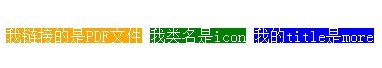

# 6.1 CSS3选择器 属性选择器
在HTML中，通过各种各样的属性可以给元素增加很多附加的信息。例如，通过id属性可以将不同div元素进行区分。

在CSS2中引入了一些属性选择器，而CSS3在CSS2的基础上对属性选择器进行了扩展，新增了3个属性选择器，使得属性选择器有了通配符的概念，这三个属性选择器与CSS2的属性选择器共同构成了CSS功能强大的属性选择器。如下表所示：


 实例展示：

html代码：
```html
<a href="xxx.pdf">我链接的是PDF文件</a>
<a href="#" class="icon">我类名是icon</a>
<a href="#" title="我的title是more">我的title是more</a>
```
css代码  
```css
a{
  color:#fff;
}
a[href$=pdf]{
  background: orange;
}
a[class^=icon]{
  background: green;
}
a[title*=more]{
  background: blue;
}
```


# 6.2 CSS3 结构性伪类选择器—root
`:root`选择器，从字面上我们就可以很清楚的理解是根选择器，他的意思就是匹配元素`E`所在文档的根元素。在`HTML文`档中，根元素始终是`<html>`。

示例演示：

通过 ``:root`` 选择器设置背景颜色

HTML代码：
```html
<div>:root选择器的演示</div>
```
CSS代码：
```css
:root {
  background:orange;
}
```

 ``:root`` 选择器等同于`<html>`元素，简单点说：
```
:root{background:orange}
```
```
html {background:orange;}
```
得到的效果等同。

建议使用`:root`方法。

# 6.3 CSS3 结构性伪类选择器—not
`:not`选择器称为否定选择器，和`jQuery`中的`:not`选择器一模一样，可以选择除某个元素之外的所有元素。就拿`form`元素来说，比如说你想给表单中除`submit`按钮之外的`input`元素添加红色边框，CSS代码可以写成：
```css
form {
  width: 200px;
  margin: 20px auto;
}
div {
  margin-bottom: 20px;
}
input:not([type="submit"]){
  border:1px solid red;
}
```
相关HTML代码：
```html
<form action="#">
  <div>
    <label for="name">Text Input:</label>
    <input type="text" name="name" id="name" placeholder="John Smith" />
  </div>
  <div>
    <label for="name">Password Input:</label>
    <input type="text" name="name" id="name" placeholder="John Smith" />
  </div>
  <div>
    <input type="submit" value="Submit" />
  </div>
</form>  ​
```

# 6.4 CSS3 结构性伪类选择器—empty
`:empty`选择器表示的就是空。用来选择没有任何内容的元素，这里没有内容指的是一点内容都没有，哪怕是一个空格。

示例显示：

比如说，你的文档中有三个段落`p`元素，你想把没有任何内容的`P`元素隐藏起来。我们就可以使用 ``:empty`` 选择器来控制。

HTML代码：
```html
<p>我是一个段落</p>
<p> </p>
<p></p>​
```
CSS代码：
```css
p{
 background: orange;
 min-height: 30px;
}
p:empty {
  display: none;
}​
```

# 6.5 CSS3 结构性伪类选择器—target
`:target`选择器称为目标选择器，用来匹配文档(页面)的`url`的某个标志符的目标元素。我们先来上个例子，然后再做分析。

## 示例展示

>点击链接显示隐藏的段落。

HTML代码：
```html
<h2><a href="#brand">Brand</a></h2>
<div class="menuSection" id="brand">
    content for Brand
</div>
```
CSS代码：
```css
.menuSection{
  display: none;
}
:target{/*这里的:target就是指id="brand"的div对象*/
  display:block;
}
```
演示结果：


分析：

- 1、具体来说，触发元素的URL中的标志符通常会包含一个#号，后面带有一个标志符名称，上面代码中是：#brand

- 2、`:target`就是用来匹配`id`为 ``brand`` 的元素（id="brand"的元素）,上面代码中是那个`div`元素。

## 多个url（多个target）处理：

就像上面的例子，`#brand`与后面的`id="brand"`是对应的，当同一个页面上有很多的url的时候你可以取不同的名字，只要#号后对的名称与`id=""`中的名称对应就可以了。
如下面例子：
html代码：  
```html
<h2><a href="#brand">Brand</a></h2>
<div class="menuSection" id="brand">
  content for Brand
</div>

<h2><a href="#jake">Brand</a></h2>
<div class="menuSection" id="jake">
 content for jake
</div>

<h2><a href="#aron">Brand</a></h2>
<div class="menuSection" id="aron">
    content for aron
</div>
```
css代码：
```css
#brand:target {
  background: orange;
  color: #fff;
}
#jake:target {
  background: blue;
  color: #fff;
}
#aron:target {
  background: red;
  color: #fff;
}
```
上面的代码可以对不同的`target`对象分别设置不的样式。
> 我的笔记。这里点击链接，链接目标样式改变，以前大多数都是用js来实现的。有了这个属性，可以直接设置样式了

# 6.6 CSS3 结构性伪类选择器—first-child
`:first-child` 选择器表示的是选择父元素的第一个子元素的元素E。简单点理解就是选择元素中的第一个子元素，记住是`子元素`，而不是后代元素。

示例演示

通过 `:first-child` 选择器定位列表中的第一个列表项，并将序列号颜色变为红色。

HTML代码：
```html
<ol>
  <li><a href="##">Link1</a></li>
  <li><a href="##">Link2</a></li>
  <li><a href="##">link3</a></li>
</ol>
```
CSS代码：
```css
ol > li{
  font-size:20px;
  font-weight: bold;
  margin-bottom: 10px;
}

ol a {
  font-size: 16px;
  font-weight: normal;
}

ol > li:first-child{
  color: red;
}
```

# 6.7 CSS3 结构性伪类选择器—last-child
`:last-child` 选择器与 `:first-child` 选择器作用类似，不同的是 `:last-child` 选择器选择的是元素的最后一个子元素。例如，需要改变的是列表中的最后一个`li`的背景色，就可以使用这个选择器，
```
ul>li:last-child{background:blue;}
```
示例演示

在博客的排版中，每个段落都有 `15px` 的 `margin-bottom` ，假设不想让博客`post` 中最后一个段落保留底部的`margin`值，可以使用`:last-child`选择器。

HTML代码：
```html
<div class="post">
  <p>第一段落</p>
  <p>第二段落</p>
  <p>第三段落</p>
  <p>第四段落</p>
  <p>第五段落</p>
</div>​

```
CSS代码：
```css
.post {
  padding: 10px;
  border: 1px solid #ccc;
  width: 200px;
  margin: 20px auto;
}
.post p {
  margin:0 0 15px 0;
}

.post p:last-child {
  margin-bottom:0;
}
```

# 6.8 CSS3 结构性伪类选择器—nth-child(n)
`:nth-child(n)`选择器用来定位某个父元素的一个或多个特定的子元素。其中 `n` 是其参数，而且可以是整数值`(1,2,3,4)`，也可以是表达式`(2n+1、-n+5)`和关键词`(odd、even)`，但参数n的起始值始终是1，而不是0。也就是说，参数n的值为0时，选择器将选择不到任何匹配的元素。

经验与技巧:当 `:nth-child(n)` 选择器中的n为一个表达式时，其中n是从 `0` 开始计算，当表达式的值为0或小于0的时候，不选择任何匹配的元素。

>**特别注意，有效位置是从1开始的**

>odd 奇数，even 偶数

案例演示

  通过`:nth-child(n)`选择器，并且参数使用表达式 `2n`，将偶数行列表背景色设置为橙色。

HTML代码：
```html
<ol>
  <li>item1</li>
  <li>item2</li>
  <li>item3</li>
  <li>item4</li>
  <li>item5</li>
  <li>item6</li>
</ol>​
```
CSS代码：

```css
ol > li:nth-child(2n){
  background: orange;
}
```

# 6.9 CSS3 结构性伪类选择器—nth-last-child(n)
`:nth-last-child(n)` 选择器和前面的 `:nth-child(n)` 选择器非常的相似，只是这里多了一个 `last` ，所起的作用和 `:nth-child(n)` 选择器有所区别，从某父元素的最后一个子元素开始计算，来选择特定的元素。

案例演示

选择列表中倒数第五个列表项，将其背景设置为橙色。

HTML代码：
```html
<ol>
  <li>item1</li>
  <li>item2</li>
  <li>item3</li>
  <li>item4</li>
  <li>item5</li>
  <li>item6</li>
</ol>​
```
CSS代码：

```css
ol > li:nth-last-child(5){
  background: orange;
}
```

# 6.10 CSS3 first-of-type选择器
 `:first-of-type` 选择器类似于 `:first-child` 选择器，不同之处就是指定了元素的类型,其主要用来定位一个父元素下的某个类型的第一个子元素。

示例演示：

通过 `:first-of-type` 选择器，定位 `div` 容器中的第一个 `p` 元素（ `p` 不一定是容器中的第一个子元素），并设置其背景色为橙色。

HTML代码：
```html
<div class="wrapper">
  <div>我是一个块元素，我是.wrapper的第一个子元素</div>
  <p>我是一个段落元素，我是不是.wrapper的第一个子元素，但是他的第一个段落元素</p>
  <p>我是一个段落元素</p>
  <div>我是一个块元素</div>
</div>
```
CSS代码：
```css
.wrapper {
  width: 500px;
  margin: 20px auto;
  padding: 10px;
  border: 1px solid #ccc;
  color: #fff;
}
.wrapper > div {
  background: green;
}
.wrapper > p {
  background: blue;
}
/*我要改变第一个段落的背景为橙色*/
.wrapper > p:first-of-type {
  background: orange;
}
```

# 6.11 CSS3 nth-of-type(n)选择器
 `:nth-of-type(n)` 选择器和 `:nth-child(n)` 选择器非常类似，不同的是它只计算父元素中指定的某种类型的子元素。当某个元素中的子元素不单单是同一种类型的子元素时，使用 `:nth-of-type(n)` 选择器来定位于父元素中某种类型的子元素是非常方便和有用的。在 `:nth-of-type(n)` 选择器中的 `n` 和 `:nth-child(n)` 选择器中的 `n` 参数也一样，可以是具体的整数，也可以是表达式，还可以是关键词。

示例演示

通过 `:nth-of-type(2n)` 选择器，将容器 `div.wrapper` 中偶数段数的背景设置为橙色。

HTML代码：
```html
<div class="wrapper">
  <div>我是一个Div元素</div>
  <p>我是一个段落元素</p>
  <div>我是一个Div元素</div>
  <p>我是一个段落</p>
  <div>我是一个Div元素</div>
  <p>我是一个段落</p>
  <div>我是一个Div元素</div>
  <p>我是一个段落</p>
  <div>我是一个Div元素</div>
  <p>我是一个段落</p>
  <div>我是一个Div元素</div>
  <p>我是一个段落</p>
  <div>我是一个Div元素</div>
  <p>我是一个段落</p>
  <div>我是一个Div元素</div>
  <p>我是一个段落</p>
</div>
```
CSS代码：
```css
.wrapper > p:nth-of-type(2n){
  background: orange;
}
```

# 6.12 CSS3 last-of-type选择器
 `:last-of-type` 选择器和 `:first-of-type` 选择器功能是一样的，不同的是他选择是父元素下的某个类型的最后一个子元素。

示例演示

通过 `:last-of-type` 选择器，将容器 `div.wrapper` 中最后一个段落元素背景设置为橙色

（提示：这个段落不是 `div.wrapper` 容器的最后一个子元素）。

HTML代码：
```html
<div class="wrapper">
  <p>我是第一个段落</p>
  <p>我是第二个段落</p>
  <p>我是第三个段落</p>
  <div>我是第一个Div元素</div>
  <div>我是第二个Div元素</div>
  <div>我是第三个Div元素</div>
</div>
```
CSS代码：
```css
 .wrapper > p:last-of-type{
  background: orange;
}
```

# 6.12 :nth-last-of-type(n) 选择器
和`:nth-of-type(n)` 选择器是一样的，选择父元素中指定的某种子元素类型，但它的起始方向是从最后一个子元素开始，而且它的使用方法类似于上节中介绍的`:nth-last-child(n)` 选择器一样。

示例演示

通过`:nth-last-of-type(n)` 选择器将容器`div.wrapper` 中的倒数第三个段落背景设置为橙色。

HTML代码：
```html
<div class="wrapper">
  <p>我是第一个段落</p>
  <p>我是第二个段落</p>
  <p>我是第三个段落</p>
  <p>我是第四个段落</p>
  <p>我是第五个段落</p>
  <div>我是一个Div元素</div>
  <p>我是第六个段落</p>
  <p>我是第七个段落</p>
</div>
```
CSS代码：
```css
.wrapper > p:nth-last-of-type(3){
  background: orange;
}
```

# 6.14 CSS3 only-child选择器
`:only-child`选择器选择的是父元素中只有一个子元素，而且只有唯一的一个子元素。也就是说，匹配的元素的父元素中仅有一个子元素，而且是一个唯一的子元素。

示例演示

通过`:only-child`选择器，来控制仅有一个子元素的背景样式，为了更好的理解，我们这个示例通过对比的方式来向大家演示。

HTML代码：

```html
<div class="post">
  <p>我是一个段落</p>
  <p>我是一个段落</p>
</div>
<div class="post">
  <p>我是一个段落</p>
</div>
```

CSS代码：

```css
.post p {
  background: green;
  color: #fff;
  padding: 10px;
}
.post p:only-child {
  background: orange;
} 
```

# 6.15 CSS3 only-of-type选择器
`:only-of-type`选择器用来选择一个元素是它的父元素的`唯一一个相同类型`的`子元素`。这样说或许不太好理解，换一种说法。`:only-of-type`是表示一个元素他有很多个子元素，而其中只有一种类型的子元素是唯一的，使用`:only-of-type`选择器就可以选中这个元素中的唯一一个类型子元素。

示例演示

通过`:only-of-type`选择器来修改容器中仅有一个div元素的背景色为橙色。

HTML代码：
```
<div class="wrapper">
  <p>我是一个段落</p>
  <p>我是一个段落</p>
  <p>我是一个段落</p>
  <div>我是一个Div元素</div>
</div>
<div class="wrapper">
  <div>我是一个Div</div>
  <ul>
    <li>我是一个列表项</li>
  </ul>
  <p>我是一个段落</p>
</div>
```
CSS代码：
```
.wrapper > div:only-of-type {
  background: orange;
}
```

# 6.16 CSS3选择器 :enabled选择器
在Web的表单中，有些表单元素有可用（`:enabled`）和不可用（`:disabled`）状态，比如输入框，密码框，复选框等。在默认情况之下，这些表单元素都处在可用状态。那么我们可以通过伪选择器`:enabled`对这些表单元素设置样式。

示例演示

通过`:enabled`选择器，修改文本输入框的边框为2像素的红色边框，并设置它的背景为灰色。

HTML代码:
```html
<form action="#">
  <div>
    <label for="name">Text Input:</label>
    <input type="text" name="name" id="name" placeholder="可用输入框"  />
  </div>
   <div>
    <label for="name">Text Input:</label>
    <input type="text" name="name" id="name" placeholder="禁用输入框"  disabled="disabled" />
  </div>
</form>
```
CSS代码：
```css
div{
  margin: 20px;
}
input[type="text"]:enabled {
  background: #ccc;
  border: 2px solid red;
}
```
# 6.17 CSS3选择器 :disabled选择器
`:disabled`选择器刚好与`:enabled`选择器相反，用来选择不可用表单元素。要正常使用`:disabled`选择器，需要在表单元素的HTML中设置`disabled`属性。

示例演示

通过`:disabled`选择器，给不可用输入框设置明显的样式。

HTML代码：
```html
<form action="#">
  <div>
    <input type="text" name="name" id="name" placeholder="我是可用输入框" />
  </div>
  <div>
    <input type="text" name="name" id="name" placeholder="我是不可用输入框" disabled />
  </div>
</form>  
```
CSS代码
```css
form {
  margin: 50px;
}
div {
  margin-bottom: 20px;
}
input {
  background: #fff;
  padding: 10px;
  border: 1px solid orange;
  border-radius: 3px;
}
input[type="text"]:disabled {
  background: rgba(0,0,0,.15);
  border: 1px solid rgba(0,0,0,.15);
  color: rgba(0,0,0,.15);
}
```

# 6.18 CSS3选择器 :checked选择器
在表单元素中，单选按钮和复选按钮都具有选中和未选中状态。（大家都知道，要覆写这两个按钮默认样式比较困难）。在CSS3中，我们可以通过状态选择器`:checked`配合其他标签实现自定义样式。而`:checked`表示的是选中状态。

示例演示：

通过`:checked`状态来自定义复选框效果。

HTML代码
```
<form action="#">
  <div class="wrapper">
    <div class="box">
      <input type="checkbox" checked="checked" id="usename" /><span>√</span>
    </div>
    <lable for="usename">我是选中状态</lable>
  </div>
  
  <div class="wrapper">
    <div class="box">
      <input type="checkbox"  id="usepwd" /><span>√</span>
    </div>
    <label for="usepwd">我是未选中状态</label>
  </div>
</form> 
```
CSS代码：

```
form {
  border: 1px solid #ccc;
  padding: 20px;
  width: 300px;
  margin: 30px auto;
}

.wrapper {
  margin-bottom: 10px;
}

.box {
  display: inline-block;
  width: 20px;
  height: 20px;
  margin-right: 10px;
  position: relative;
  border: 2px solid orange;
  vertical-align: middle;
}

.box input {
  opacity: 0;
  position: absolute;
  top:0;
  left:0;
}

.box span {
  position: absolute;
  top: -10px;
  right: 3px;
  font-size: 30px;
  font-weight: bold;
  font-family: Arial;
  -webkit-transform: rotate(30deg);
  transform: rotate(30deg);
  color: orange;
}

input[type="checkbox"] + span {
  opacity: 0;
}

input[type="checkbox"]:checked + span {
  opacity: 1;
}
```

# 6.19 CSS3选择器 ::selection选择器
`::selection`伪元素是用来匹配突出显示的文本(用鼠标选择文本时的文本)。浏览器默认情况下，用鼠标选择网页文本是以`深蓝的背景，白色的字体`显示的，效果如下图所示：


从上图中可以看出，用鼠标选中`专注IT、互联网技术`、`纯干货、学以致用`、`没错、这是免费的`这三行文本中，默认显示样式为：蓝色背景、白色文本。

有的时候设计要求,不使用上图那种浏览器默认的突出文本效果，需要一个与众不同的效果，此时`::selection`伪元素就非常的实用。不过在Firefox浏览器还需要添加前缀。

示例演示:

通过`::selection`选择器，将Web中选中的文本背景变成红色，文本变成绿色。

HTML代码：

```html
<p>
`::selection`伪元素是用来匹配突出显示的文本。浏览器默认情况下，选择网站文本是深蓝的背景，白色的字体，
</p>
```
CSS代码：

```css
::-moz-selection {
  background: red;
  color: green;
}
::selection {
  background: red;
  color: green;
}
```

## 注意：

- 1、IE9+、Opera、Google Chrome 以及 Safari 中支持 ::selection 选择器。

- 2、Firefox 支持替代的 ::-moz-selection。

# 6.20 CSS3选择器 :read-only选择器
“:read-only”伪类选择器用来指定处于只读状态元素的样式。简单点理解就是，元素中设置了“readonly=’readonly’”

示例演示

通过“:read-only”选择器来设置地址文本框的样式。

HTML代码：
```html
<form action="#">
  <div>
    <label for="name">姓名:</label>
    <input type="text" name="name" id="name" placeholder="大漠" />
  </div>
  <div>
    <label for="address">地址:</label>
    <input type="text" name="address" id="address" placeholder="中国上海" readonly="readonly" />
  </div>
</form>  
```
CSS代码：
```css
form {
  width: 300px;
  padding: 10px;
  border: 1px solid #ccc;
  margin: 50px auto;
}
form > div {
  margin-bottom: 10px;
}

input[type="text"]{
  border: 1px solid orange;
  padding: 5px;
  background: #fff;
  border-radius: 5px;
}

input[type="text"]:-moz-read-only{
  border-color: #ccc;
}
input[type="text"]:read-only{
  border-color: #ccc;
}
```

# 6.21 CSS3选择器 :read-write选择器
“:read-write”选择器刚好与“:read-only”选择器相反，主要用来指定当元素处于非只读状态时的样式。

示例演示

使用“:read-write”选择器来设置不是只读控件的文本框样式。

HTML代码：
```html
<form action="#">
  <div>
    <label for="name">姓名:</label>
    <input type="text" name="name" id="name" placeholder="大漠" />
  </div>
  <div>
    <label for="address">地址:</label>
    <input type="text" name="address" id="address" placeholder="中国上海" readonly="readonly" />
  </div>
</form>

```
CSS代码：

```css
form {
  width: 300px;
  padding: 10px;
  border: 1px solid #ccc;
  margin: 50px auto;
}
form > div {
  margin-bottom: 10px;
}

input[type="text"]{
  border: 1px solid orange;
  padding: 5px;
  background: #fff;
  border-radius: 5px;
}

input[type="text"]:-moz-read-only{
  border-color: #ccc;
}
input[type="text"]:read-only{
  border-color: #ccc;
}

input[type="text"]:-moz-read-write{
  border-color: #f36;
}
input[type="text"]:read-write{
  border-color: #f36;
}
```

# 6.22 CSS3选择器 ::before和::after
`::before`和`::after`这两个主要用来给元素的前面或后面插入内容，这两个常和`content`配合使用，使用的场景最多的就是`清除浮动`。

```css
.clearfix::before,
.clearfix::after {
    content: ".";
    display: block;
    height: 0;
    visibility: hidden;
}
.clearfix:after {clear: both;}
.clearfix {zoom: 1;}
```
当然可以利用他们制作出其他更好的效果，比如右侧中的阴影效果，也是通过这个来实现的。

关键代码分析：
```css
.effect::before, .effect::after{
    content:"";
    position:absolute;
    z-index:-1;
    -webkit-box-shadow:0 0 20px rgba(0,0,0,0.8);
    -moz-box-shadow:0 0 20px rgba(0,0,0,0.8);
    box-shadow:0 0 20px rgba(0,0,0,0.8);
    top:50%;
    bottom:0;
    left:10px;
    right:10px;
    -moz-border-radius:100px / 10px;
    border-radius:100px / 10px;
}
```
上面代码作用在class名叫.effect上的div的前（before）后(after)都添加一个空元素，然后为这两个空元素添加阴影特效。