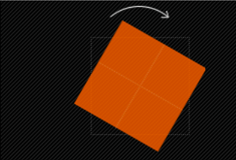
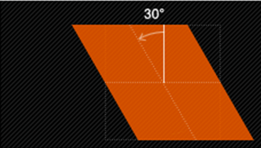
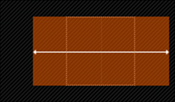
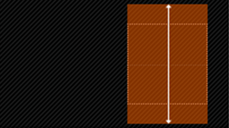
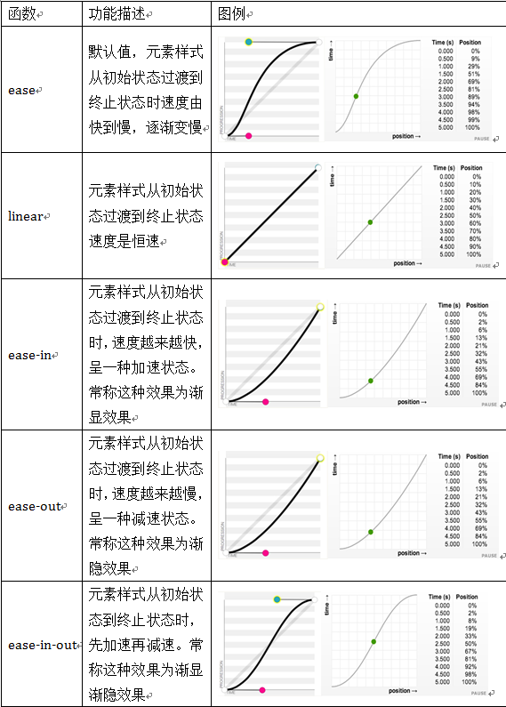

# CSS3变形--旋转 rotate()
旋转`rotate()`函数通过指定的角度参数使元素相对原点进行旋转。它主要在二维空间内进行操作，设置一个角度值，用来指定旋转的幅度。如果这个值为`正值`，元素相对原点中心`顺时针`旋转；如果这个值为`负值`，元素相对原点中心`逆时针`旋转。如下图所示：



HTML代码：
```html
<div class="wrapper">
  <div></div>
</div>
```
CSS代码：
```css
.wrapper {
  width: 200px;
  height: 200px;
  border: 1px dotted red;
  margin: 100px auto;
}
.wrapper div {
  width: 200px;
  height: 200px;
  background: orange;
  -webkit-transform: rotate(45deg);
  transform: rotate(45deg);
}
```

# CSS3中的变形--扭曲 skew()
扭曲`skew()`函数能够让元素倾斜显示。它可以将一个对象以其中心位置围绕着X轴和Y轴按照一定的角度倾斜。这与`rotate()`函数的旋转不同，`rotate()`函数只是旋转，而不会改变元素的形状。`skew()`函数不会旋转，而只会改变元素的形状。

`Skew()`具有三种情况：

- 1、`skew(x,y)`使元素在水平和垂直方向同时扭曲（X轴和Y轴同时按一定的角度值进行扭曲变形）；


第一个参数对应X轴，第二个参数对应Y轴。如果第二个参数未提供，则值为0，也就是Y轴方向上无斜切。

- 2、`skewX(x)`仅使元素在水平方向扭曲变形（X轴扭曲变形）；




- 3、`skewY(y)`仅使元素在垂直方向扭曲变形（Y轴扭曲变形）


示例演示：

通过`skew()`函数将长方形变成平行四边形。

HTML代码：
```html
<div class="wrapper">
  <div>我变成平形四边形</div>
</div>
```
CSS代码：
```css
.wrapper {
  width: 300px;
  height: 100px;
  border: 2px dotted red;
  margin: 30px auto;
}
.wrapper div {
  width: 300px;
  height: 100px;
  line-height: 100px;
  text-align: center;
  color: #fff;
  background: orange;
  -webkit-transform: skew(45deg);
  -moz-transform:skew(45deg) 
  transform:skew(45deg);
}
```

# CSS3中的变形--缩放 scale()
缩放 `scale()`函数 让元素根据中心原点对对象进行缩放。

缩放 `scale` 具有三种情况：

- 1、 `scale(X,Y)`使元素水平方向和垂直方向同时缩放（也就是X轴和Y轴同时缩放）
例如：


```css
div:hover {
  -webkit-transform: scale(1.5,0.5);
  -moz-transform:scale(1.5,0.5)
  transform: scale(1.5,0.5);
}
```
注意：Y是一个可选参数，如果没有设置Y值，则表示X，Y两个方向的缩放倍数是一样的。

- 2、`scaleX(x)`元素仅水平方向缩放（X轴缩放）




- 3、`scaleY(y)`元素仅垂直方向缩放（Y轴缩放）




HTML代码：
```html
<div class="wrapper">
  <div>我将放大1.5倍</div>
</div>
```
CSS代码：

```css
.wrapper {
  width: 200px;
  height: 200px;
  border:2px dashed red;
  margin: 100px auto;
}
.wrapper div {
  width: 200px;
  height: 200px;
  line-height: 200px;
  background: orange;
  text-align: center;
  color: #fff;
}
.wrapper div:hover {
  opacity: .5;
  -webkit-transform: scale(1.5);
  -moz-transform:scale(1.5)
  transform: scale(1.5);
}
```
演示结果

>注意： `scale()`的取值默认的值为1，当值设置为0.01到0.99之间的任何值，作用使一个元素缩小；而任何大于或等于1.01的值，作用是让元素放大。

# CSS3中的变形--位移 translate()
`translate()`函数可以将元素向指定的方向移动，类似于`position`中的`relative`。或以简单的理解为，使用`translate()`函数，可以把元素从原来的位置移动，而不影响在X、Y轴上的任何Web组件。

`translate`我们分为三种情况：

- 1、`translate(x,y)`水平方向和垂直方向同时移动（也就是X轴和Y轴同时移动）


- 2、`translateX(x)`仅水平方向移动（X轴移动）


- 3、`translateY(Y)`仅垂直方向移动（Y轴移动）


实例演示：通过translate()函数将元素向Y轴下方移动50px,X轴右方移动100px。

HTML代码：
```html
<div class="wrapper">
  <div>我向右向下移动</div>
</div>
```
CSS代码：

```css
.wrapper {
  width: 200px;
  height: 200px;
  border: 2px dotted red;
  margin: 20px auto;
}
.wrapper div {
  width: 200px;
  height: 200px;
  line-height: 200px;
  text-align: center;
  background: orange;
  color: #fff;
  -webkit-transform: translate(50px,100px);
  -moz-transform:translate(50px,100px);
  transform: translate(50px,100px);
}
```

# CSS3中的变形--矩阵 matrix()

CSS 函数 `matrix()` 用六个指定的值来指定一个均匀的二维（2D）变换矩阵。这个矩形中的常量值是不作为参数进行传递的，其他的参数则在主要列的顺序中描述。

`matrix(a, b, c, d, tx, ty)` 是 `matrix3d(a, b, 0, 0, c, d, 0, 0, 0, 0, 1, 0, tx, ty, 0, 1)` 的简写


语法
```css
matrix(a, b, c, d, tx, ty)
```
属性值

**a b c d**

以 `<number>` 的格式来描述线性变换
**tx ty**

以 `<number>` 的格式来描述变换的量


<table class="standard-table">
 <thead>
  <tr>
   <th scope="col"><br>
    <sup>笛卡尔坐标系中用二阶矩阵表示的点坐标</sup></th>
   <th scope="col"><br>
    <sup>齐次坐标系中用三阶矩阵表示的点坐标</sup></th>
   <th scope="col"><br>
    <sup>笛卡尔坐标系中用三阶矩阵表示的点坐标</sup></th>
   <th scope="col"><br>
    <sup>齐次坐标系中用四阶矩阵表示的点坐标</sup></th>
  </tr>
 </thead>
 <tbody>
  <tr>
   <td colspan="1" rowspan="2"><math><mfenced><mtable><mtr><mtd>&nbsp; &nbsp; &nbsp; &nbsp; &nbsp; &nbsp; &nbsp; a </mtd><mtd>c</mtd></mtr></mtable></mfenced></math><br>
    <mtr><mtd>&nbsp; &nbsp; &nbsp; &nbsp; &nbsp; &nbsp; &nbsp; &nbsp;b &nbsp;</mtd><mtd>d</mtd></mtr></td>
   <td><math><mfenced><mtable><mtr><mtd>&nbsp; &nbsp; &nbsp; &nbsp; &nbsp; &nbsp;a </mtd><mtd>c </mtd><mtd>ty</mtd></mtr></mtable></mfenced></math><br>
    <mtr><mtd>&nbsp; &nbsp; &nbsp; &nbsp; &nbsp; &nbsp; b &nbsp;</mtd><mtd>d &nbsp;</mtd><mtd>tx</mtd></mtr><br>
    <mtr><mtd>&nbsp; &nbsp; &nbsp; &nbsp; &nbsp; &nbsp; 0 &nbsp;</mtd><mtd>0 &nbsp;</mtd><mtd>1</mtd></mtr></td>
   <td colspan="1" rowspan="2"><math><mfenced><mtable><mtr><mtd>&nbsp; &nbsp; &nbsp; &nbsp; &nbsp; &nbsp; &nbsp;a </mtd><mtd>c </mtd><mtd>ty</mtd></mtr></mtable></mfenced></math><br>
    <mtr><mtd>&nbsp; &nbsp; &nbsp; &nbsp; &nbsp; &nbsp; &nbsp; b &nbsp;</mtd><mtd>d &nbsp;</mtd><mtd>tx</mtd></mtr><br>
    <mtr><mtd>&nbsp; &nbsp; &nbsp; &nbsp; &nbsp; &nbsp; &nbsp; 0 &nbsp;</mtd><mtd>0 &nbsp;</mtd><mtd>1</mtd></mtr></td>
   <td colspan="1" rowspan="2"><math><mfenced><mtable><mtr><mtd>&nbsp; &nbsp; &nbsp; &nbsp; &nbsp; a </mtd><mtd>c </mtd><mtd>0 </mtd><mtd>tx</mtd></mtr></mtable></mfenced></math><br>
    <mtr><mtd>&nbsp; &nbsp; &nbsp; &nbsp; &nbsp; &nbsp;b &nbsp;</mtd><mtd>d &nbsp;</mtd><mtd>0 &nbsp;</mtd><mtd>ty</mtd></mtr><br>
    <mtr><mtd>&nbsp; &nbsp; &nbsp; &nbsp; &nbsp; &nbsp;0 &nbsp;</mtd><mtd>0 &nbsp;</mtd><mtd>1 &nbsp;</mtd><mtd>0</mtd></mtr><br>
    <mtr><mtd>&nbsp; &nbsp; &nbsp; &nbsp; &nbsp; &nbsp;0 &nbsp;</mtd><mtd>0 &nbsp;</mtd><mtd>0 &nbsp;</mtd><mtd>1</mtd></mtr></td>
  </tr>
  <tr>
   <td>&nbsp;<code>[a b c d tx ty]</code></td>
  </tr>
 </tbody>
</table>

示例演示：
通过`matrix()`函数来模拟`transform`中`translate()`位移的效果。
HTML代码：
```html
<div class="wrapper">
  <div></div>
</div>
```
CSS代码：

```css
.wrapper {
  width: 300px;
  height: 200px;
  border: 2px dotted red;
  margin: 40px auto;
}
.wrapper div {
  width:300px;
  height: 200px;
  background: orange;
  -webkit-transform: matrix(1,0,0,1,50,50);
  -moz-transform:matrix(1,0,0,1,50,50);
  transform: matrix(1,0,0,1,50,50);
}
```
>[张鑫旭参考资料](https://www.zhangxinxu.com/wordpress/2012/06/css3-transform-matrix-%E7%9F%A9%E9%98%B5/)

# CSS3中的变形--原点 transform-origin
任何一个元素都有一个中心点，默认情况之下，其中心点是居于元素X轴和Y轴的50%处。

在没有重置`transform-origin`改变元素原点位置的情况下，CSS变形进行的旋转、位移、缩放，扭曲等操作都是以元素自己中心位置进行变形。但很多时候，我们可以通过`transform-origin`来对元素进行原点位置改变，使元素原点不在元素的中心位置，以达到需要的原点位置。

`transform-origin`取值和元素设置背景中的`background-position`取值类似，如下表所示：


示例展示：

通过`transform-origin`改变元素原点到左上角，然后进行顺时旋转45度。

HTML代码：
```html
<div class="wrapper">
  <div>原点在默认位置处</div>
</div>
<div class="wrapper transform-origin">
  <div>原点重置到左上角</div>
</div>
```
CSS代码：

```css
.wrapper {
  width: 300px;
  height: 300px;
  float: left;
  margin: 100px;
  border: 2px dotted red;
  line-height: 300px;
  text-align: center;
}
.wrapper div {
  background: orange;
  -webkit-transform: rotate(45deg);
  transform: rotate(45deg);
}
.transform-origin div {
  -webkit-transform-origin: left top;
  transform-origin: left top;
}
```

# CSS3中的动画--过渡属性 transition-property 
早期在Web中要实现动画效果，都是依赖于JavaScript或Flash来完成。但在CSS3中新增加了一个新的模块`transition`，它可以通过一些简单的CSS事件来触发元素的外观变化，让效果显得更加细腻。简单点说，就是通过鼠标的单击、获得焦点，被点击或对元素任何改变中触发，并平滑地以动画效果改变CSS的属性值。

在CSS中创建简单的过渡效果可以从以下几个步骤来实现：
- 第一，在默认样式中声明元素的初始状态样式；
- 第二，声明过渡元素最终状态样式，比如悬浮状态；
- 第三，在默认样式中通过添加过渡函数，添加一些不同的样式。

CSS3的过度`transition`属性是一个复合属性，主要包括以下几个子属性：

- `transition-property`:指定过渡或动态模拟的CSS属性
- `transition-duration`:指定完成过渡所需的时间
- `transition-timing-function`:指定过渡函数
- `transition-delay`:指定开始出现的延迟时间
先来看`transition-property`属性

`transition-property`用来指定过渡动画的CSS属性名称，而这个过渡属性只有具备一个中点值的属性（需要产生动画的属性）才能具备过渡效果，其对应具有过渡的CSS属性主要有：


HTML:
```html
<div></div>
```
CSS:
```css
div {
  width: 200px;
  height: 200px;
  background-color:red;
  margin: 20px auto;
  -webkit-transition: background-color .5s ease .1s;
  transition: background-color .5s ease .1s;
}
div:hover {
  background-color: orange;
}
```

# CSS3中的动画--过渡所需时间 transition-duration
`transition-duration`属性主要用来设置一个属性过渡到另一个属性所需的时间，也就是从旧属性过渡到新属性花费的时间长度，俗称持续时间。

案例演示：

在鼠标悬停（`hover`）状态下，让容器从直角慢慢过渡到圆角，并让整个动画持续0.5s。

HTML:
```html
<div></div>
```
CSS:
```css
div {
  width: 300px;
  height: 200px;
  background-color: orange;
  margin: 20px auto;
  -webkit-transition-property: -webkit-border-radius;
  transition-property: border-radius;
  -webkit-transition-duration: .5s;
  transition-duration: .5s;
  -webkit-transition-timing-function: ease-out;
  transition-timing-function: ease-out;
  -webkit-transition-delay: .2s;
  transition-delay: .2s;
}
div:hover {
  border-radius: 20px;
}
```

# CSS3中的动画--过渡函数 transition-timing-function
`transition-timing-function`属性指的是过渡的`缓动函数`。主要用来指定浏览器的过渡速度，以及过渡期间的操作进展情况，其中要包括以下几种函数：


# CSS3中的动画--过渡延迟时间 transition-delay
`transition-delay`属性和`transition-duration`属性极其类似，不同的是`transition-duration`是用来设置过渡动画的持续时间，而`transition-delay`主要用来指定一个动画开始执行的时间，也就是说当改变元素属性值后多长时间开始执行。

有时我们想改变两个或者多个css属性的`transition`效果时，只要把几个`transition`的声明串在一起，用逗号（`，`）隔开，然后各自可以有各自不同的延续时间和其时间的速率变换方式。但需要值得注意的一点：第一个时间的值为 `transition-duration`，第二个为`transition-delay`。

例如：
```css
a{ transition: background 0.8s ease-in 0.3,color 0.6s ease-out 0.3;}
```

示例演示：

通过`transition`属性将一个`200px *200px`的橙色容器，在鼠标悬浮状态时，过渡到一个`300px * 300px`的红色容器。而且整个过渡`0.1s`后触发，并且整个过渡持续`0.28s`。

HTML代码:
```html
<div class="wrapper">
  <div>鼠标放到我的身上来</div>
</div>
```
CSS代码:
```css
.wrapper {
  width: 400px;
  height: 400px;
  margin: 20px auto;
  border: 2px dotted red;
}
.wrapper div {
  width: 200px;
  height: 200px;
  background-color: orange;
  -webkit-transition: all .28s ease-in .1s;
  transition: all .28s ease-in .1s;
}
.wrapper div:hover {
  width: 300px;
  height: 300px;
  background-color: red;
}
```

# CSS3 Keyframes介绍
`Keyframes`被称为关键帧，其类似于Flash中的关键帧。在CSS3中其主要以`@keyframes`开头，后面紧跟着是动画名称加上一对花括号`{…}`，括号中就是一些不同时间段样式规则。

```css
@keyframes changecolor{
  0%{
   background: red;
  }
  100%{
    background: green;
  }
}
```
在一个`@keyframes`中的样式规则可以由多个百分比构成的，如在`0%`到`100%`之间创建更多个百分比，分别给每个百分比中给需要有动画效果的元素加上不同的样式，从而达到一种在不断变化的效果。

经验与技巧：

在`@keyframes`中定义动画名称时，其中0%和100%还可以使用关键词from和to来代表，其中0%对应的是from，100%对应的是to。

浏览器的支持情况：

Chrome 和 Safari 需要前缀 `-webkit-`；Foxfire 需要前缀 `-moz-`。

案例演示

通过`@keyframes`声明一个名叫`wobble`的动画，从`0%`开始到`100%`结束，同时还经历了一个`40%`和`60%`两个过程。`wobble`动画在`0%`时元素定位到left为100px，背景色为green，然后在`40%`时元素过渡到left为150px,背景色为orange,接着在`60%`时元素过渡到left为75px，背景色为blue，最后`100%`时结束动画，元素又回到起点left为100px处，背景色变为red。

HTML:
```html
<div>鼠标放到我身上</div>
```
CSS:

```css
@keyframes wobble {
  0% {
    margin-left: 100px;
    background:green;
  }
  40% {
    margin-left:150px;
    background:orange;
  }
  60% {
    margin-left: 75px;
    background: blue;
  }
  100% {
    margin-left: 100px;
    background: red;
  }
}
div {
  width: 100px;
  height: 100px;
  background:red;
  color: #fff;
}
div:hover{
  animation: wobble 5s ease .1s;
}
```

# CSS3中调用动画
`animation-name`属性主要是用来调用 `@keyframes` 定义好的动画。需要特别注意`: animation-name `调用的动画名需要和`@keyframes`定义的动画名称完全一致（区分大小写），如果不一致将不具有任何动画效果。

语法：
```css
animation-name: none | IDENT[,none|DENT]*;
```
- 1、IDENT是由 @keyframes 创建的动画名，上面已经讲过了（animation-name 调用的动画名需要和“@keyframes”定义的动画名称完全一致）；

- 2、none为默认值，当值为 none 时，将没有任何动画效果,这可以用于覆盖任何动画。

注意：需要在 Chrome 和 Safari 上面的基础上加上-webkit-前缀，Firefox加上-moz-。

# CSS3中设置动画播放时间
`animation-duration`主要用来设置CSS3动画播放时间，其使用方法和`transition-duration`类似，是用来指定元素播放动画所持续的时间长，也就是完成从0%到100%一次动画所需时间。单位：S秒

语法规则
```css
animation-duration: <time>[,<time>]*
```
取值<time>为数值，单位为秒，其默认值为“0”，这意味着动画周期为“0”，也就是没有动画效果（如果值为负值会被视为“0”）。

案例演示：

制作一个矩形变成圆形的动画，整个动画播放时间持续了10s钟。

HTML:
```html
<div>Hover Me</div>
```
CSS:
```css
@keyframes toradius{
  from {
    border-radius: 0;
  }
  to {
    border-radius: 100%;
  }
}
div {
  width: 200px;
  height: 200px;
  line-height: 200px;
  text-align: center;
  color: #fff;
  background: green;
  margin: 20px auto;
}
div:hover {
  animation-name: toradius;
  animation-duration: 10s;
  animation-timing-function: ease-in-out;
  animation-delay: .1s;
}
```

# CSS3中设置动画播放方式
`animation-timing-function`属性主要用来设置动画播放方式。主要让元素根据时间的推进来改变属性值的变换速率，简单点说就是动画的播放方式。

语法规则：
```css
animation-timing-function:ease | linear | ease-in | ease-out | ease-in-out | cubic-bezier(<number>, <number>, <number>, <number>) [, ease | linear | ease-in | ease-out | ease-in-out | cubic-bezier(<number>, <number>, <number>, <number>)]*
```
它和`transition`中的`transition-timing-function`一样，具有以下几种变换方式：`ease,ease-in,ease-in-out,ease-out,linear和cubic-bezier`。对应功如下：



在调用move动画播放中，让元素样式从初始状态到终止状态时，先加速再减速，也就是渐显渐隐效果。

# CSS3中设置动画开始播放的时间
`animation-delay`属性用来定义动画开始播放的时间，用来触发动画播放的时间点。和`transition-delay`属性一样，用于定义在浏览器开始执行动画之前等待的时间。

语法规则：
```css
animation-delay:<time>[,<time>]*
```
案例演示：    

浏览器渲染样式之后2S之后触发move动画。

HTML:
```html
<div>
  <span></span>
</div>
```
CSS:

```css
@keyframes move {
  0%{
    transform: translate(0);
  }
  15%{
    transform: translate(100px,180px);
  }
  30%{
    transform: translate(150px,0);
  }
  45%{
    transform: translate(250px,180px);
  }
  60%{
    transform:translate(300px,0);
  }
  75%{
    transform: translate(450px,180px);
  }
  100%{
    transfrom: translate(480px,0);
  }
}
div {
  width: 500px;
  height: 200px;
  border: 1px solid red;
  margin: 20px auto;
}
div span {
  display: inline-block;
  width: 20px;
  height: 20px;
  background: green;
  border-radius: 100%;
  animation-name:move;
  animation-duration: 10s;
  animation-timing-function:ease;
  animation-delay:2s;
  animation-iteration-count:infinite;
}
```

# CSS3中设置动画播放次数
`animation-iteration-count`属性主要用来定义动画的播放次数。

语法规则：
```css
animation-iteration-count: infinite | <number> [, infinite | <number>]*
```
- 1、其值通常为整数，但也可以使用带有小数的数字，其默认值为1，这意味着动画将从开始到结束只播放一次。

- 2、如果取值为`infinite`，动画将会无限次的播放。

举例：

通过`animation-iteration-count`属性让动画move只播放5次，代码设置为：
```css
animation-iteration-count:5;
```
注意：Chrome或Safari浏览器，需要加入-webkit-前缀！

# CSS3中设置动画播放方向
`animation-direction`属性主要用来设置动画播放方向，

其语法规则如下：
```css
animation-direction:normal | alternate [, normal | alternate]*
```
其主要有两个值：`normal、alternate`

- 1、normal是默认值，如果设置为normal时，动画的每次循环都是向前播放；

- 2、另一个值是alternate，他的作用是，动画播放在第偶数次向前播放，第奇数次向反方向播放。

例如：通过`animation-direction`属性，将move动画播放动画方向设置为`alternate`，代码为：
```css
animation-direction:alternate;
```
注意：Chrome或Safari浏览器，需要加入-webkit-前缀！

# CSS3中设置动画的播放状态
`animation-play-state`属性主要用来控制元素动画的播放状态。

参数：

其主要有两个值：`running`和`paused`。

其中running是其默认值，主要作用就是类似于音乐播放器一样，可以通过paused将正在播放的动画停下来，也可以通过running将暂停的动画重新播放，这里的重新播放不一定是从元素动画的开始播放，而是从暂停的那个位置开始播放。另外如果暂停了动画的播放，元素的样式将回到最原始设置状态。

例如，页面加载时，动画不播放。代码如下：
```css
animation-play-state:paused;
```
# CSS3中设置动画时间外属性
`animation-fill-mode`属性定义在动画开始之前和结束之后发生的操作。主要具有四个属性值：`none、forwards、backwords和both`。其四个属性值对应效果如下：

|属性值|效果|
| -- | -- |
|`none`|默认值，表示动画将按预期进行和结束，在动画完成其最后一帧时，动画会反转到初始帧处|
|`forwards`|表示动画在结束后继续应用最后的关键帧的位置|
|`backwards`|会在向元素应用动画样式时迅速应用动画的初始帧|
|`both`|元素动画同时具有`forwards`和`backwards`效果|

在默认情况之下，动画不会影响它的关键帧之外的属性，使用animation-fill-mode属性可以修改动画的默认行为。简单的说就是告诉动画在第一关键帧上等待动画开始，或者在动画结束时停在最后一个关键帧上而不回到动画的第一帧上。或者同时具有这两个效果。

例如：让动画停在最一帧处。代码如下：
```css
 animation-fill-mode:forwards; 
```